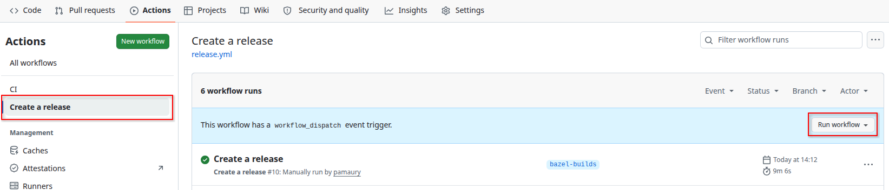
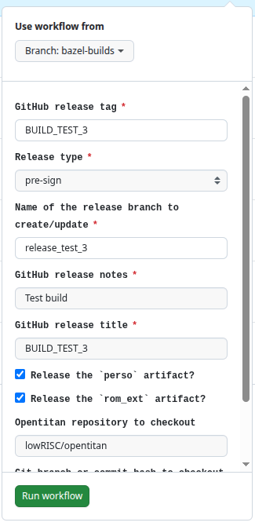
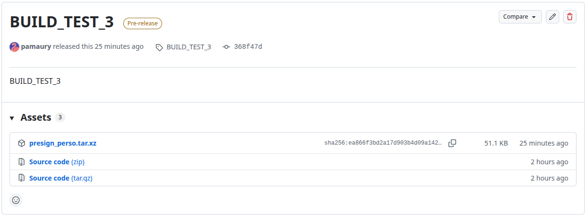
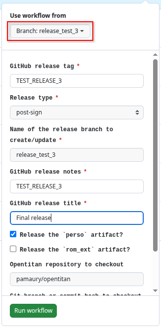
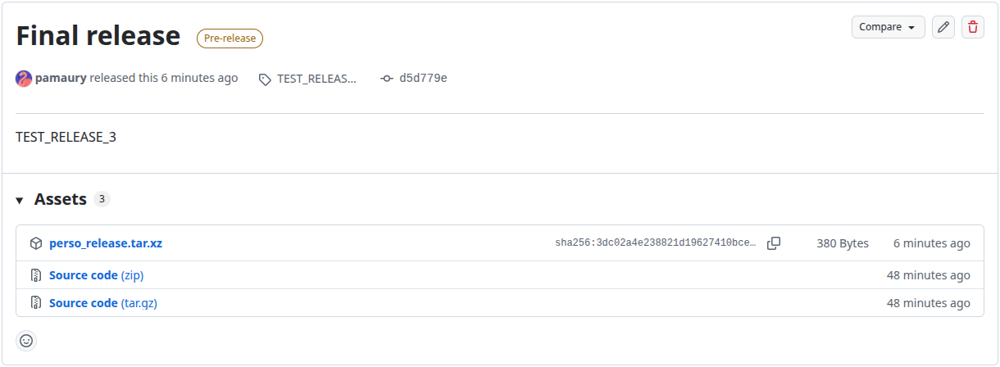

# Creating a release

Creating a release of the provisioning and ROM_EXT artifacts is a multi-step process, most of which is automated using Github Actions.
This document covers the user-facing part of the release flow. See also the [Developer documentation](create_release_dev.md).

## Step 1: creating pre-signing release artifacts

The first step consists in building the pre-sign artifacts. This step is completely automated using Github Actions.
- Select the `Create release` workflow in the `Actions` of the repository.
  
- Click on the `Run workflow` button and fill out the parameters of the release. Most parameters should be clear.
  - The tag will be used to tag the release of the pre-signing artifacts (the final release uses a different tag).
  - It supports using any OpenTitan repository and/or branch which is compatible with the `earlgrey_1.0.0` branch.
    The default choice is `lowRISC/opentitan` and `earlgrey_1.0.0`.
  - Make sure to choose an appropriate **release branch name**. In particular, if you are doing a real release,
    make sure that this branch is covered by the **branch protection rules**. It is suggested to make your branch
    name start with `release_`.

  
- If the workflow runs successfully, a release will be created with the pre-signing artifacts.
  

## Step 2: signing the artifacts

Signing the artifacts is a manual, typically off-line, step.
The `presign_perso.tar.xz` and `presign_rom_ext.tar.xz` archives contains the digests and `hsmtool` instructions to execute.
This flow typically looks like this:
```bash
# Setup hsmtool environment to use either SoftHSM or a real HSM.
# Download presign_perso.tar.xz and presign_rom_ext.tar.xz
# Extract then.
mkdir presign_perso presign_rom_ext
tar -xvf presign_perso.tar.xz -C presign_perso
tar -xvf presign_rom_ext.tar.xz -C presign_rom_ext
# Execute signing.
pushd presign_perso
/path/to/hsmtool $HSMTOOL_CUSTOM_ARG exec provisioning_ot00.json
popd
pushd presign_rom_ext
/path/to/hsmtool $HSMTOOL_CUSTOM_ARG exec rom_ext.json
popd
# Checkout the release branch of ot-sku repository.
git checkout <release branch>
# Copy the signatures to the repository.
cp presign_perso/*_sig /path/to/ot-sku/skus/open/signatures/perso/
cp presign_rom_mext/*_sig /path/to/ot-sku/skus/open/signatures/rom_ext/
# Commit the signature (and usually a signing ceremony log).
git commit -vas
# Push the signature to the release branch via a PR.
git push <remote>
```

At the end of this step, the release branch must contain the correct signatures in the `skus/open/signatures/perso/`
and/or `skus/open/signatures/rom_ext` repositories.

## Step 3: create the post-signing release artifacts

This step consists in building the final artifacts and release. This step is completely automated using Github Actions.
- Select the `Create release` workflow in the `Actions` of the repository.
  
- Click on the `Run workflow` button and fill out the parameters of the release. Most parameters should be clear.
  - **Importantly** make sure that you run the flow the release branch!

  
- If the workflow runs successfully, a release will be created with the final artifacts.
  
