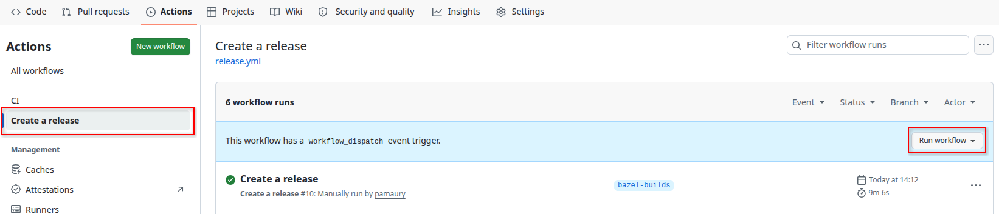
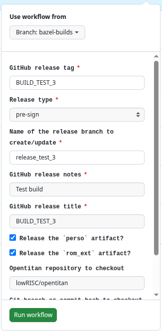
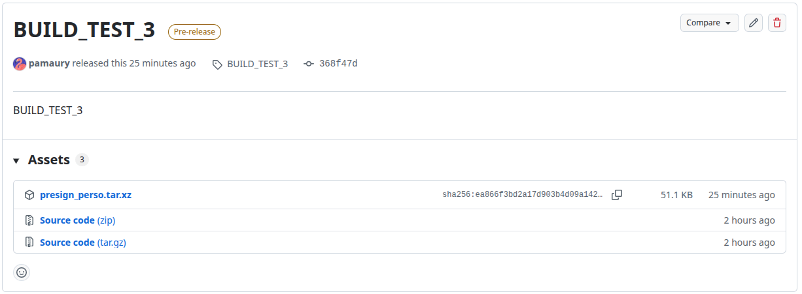
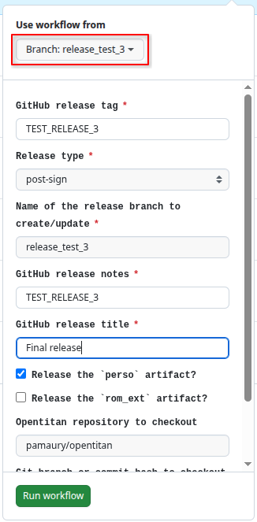
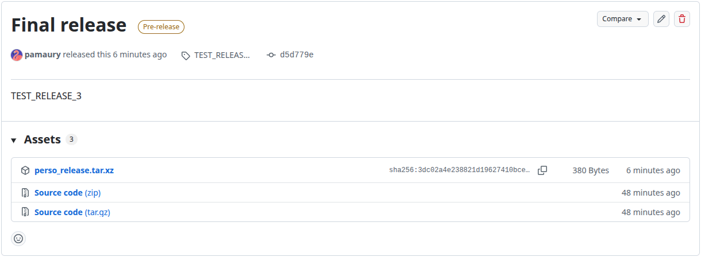

<!--
# Copyright lowRISC contributors (OpenTitan project).
# Licensed under the Apache License, Version 2.0, see LICENSE for details.
# SPDX-License-Identifier: Apache-2.0
-->

# Creating a release

Creating a release of the provisioning and ROM_EXT artifacts is a multi-step process, most of which is automated using Github Actions.
This document covers the user-facing part of the release flow.
See also the [Developer documentation](create_release_dev.md) for guidance on maintaining & developing this workflow.

## Step 1: creating pre-signing release artifacts

The first step consists in building the pre-signing artifacts.
This step is completely automated using Github Actions.
- Select the `Create a release` workflow in the `Actions` tab of the repository.
  
- Click on the `Run workflow` dropdown and fill out the parameters of the release - most parameters should be clear:
  - The tag will be used to tag the release of the pre-signing artifacts (the final release uses a different tag).
  - It supports using any OpenTitan repository and/or branch which is compatible with the `earlgrey_1.0.0` branch.
    The default choice is `lowRISC/opentitan` and `earlgrey_1.0.0`.
  - Make sure to choose an appropriate **release branch name**.
    > ⚠️ In particular, if you are doing a real release, make sure that this branch is covered by the **branch protection rules**.
    > It is suggested to make your branch name start with `release_` and to protect all such branches.

  
- If the workflow runs successfully, a release will be created with the pre-signing artifacts.
  

## Step 2: signing the artifacts

Signing the artifacts is a manual step that typically occurs in an offline environment.
The `presign_perso.tar.xz` and `presign_rom_ext.tar.xz` archives provided by the release contain the digests and relevant `hsmtool` instructions to execute.
This flow typically looks like this:
```bash
# Setup the SKU that you are making a release for:
export OT_SKU=ot00
export OT_SKU_PATH=/path/to/your/ot-sku
export HSMTOOL=/path/to/your/hsmtool

# Setup your hsmtool environment to use either SoftHSM or a real HSM.
# Download presign_perso.tar.xz and presign_rom_ext.tar.xz from the pre-signing release created in step (1) and verify their hashes.
# When you are happy with the contents and have prepared your environment, extract the archives:
mkdir presign_perso presign_rom_ext
tar -xvf presign_perso.tar.xz -C presign_perso
tar -xvf presign_rom_ext.tar.xz -C presign_rom_ext

# Ensure that the expected signature files are present, and then execute the signing.
pushd presign_perso
$HSMTOOL $HSMTOOL_CUSTOM_ARG exec provisioning_${OT_SKU}.json
popd
pushd presign_rom_ext
$HSMTOOL $HSMTOOL_CUSTOM_ARG exec rom_ext.json
popd

# Checkout the release branch of ot-sku repository.
git checkout <release branch>
# Copy the signatures to the repository.
cp presign_perso/*_sig ${OT_SKU_PATH}/skus/open/signatures/perso/
cp presign_rom_ext/*_sig ${OT_SKU_PATH}/skus/open/signatures/rom_ext/

# Prepare the signing artifacts. First, stage the signature files.
# These are protected by `.gitignore` to avoid unintentionally committing signatures, so you must manually add them with `--force`.
# Make sure you check that the files staged for commit are correct!
git add --force ${OT_SKU_PATH}/skus/open/signatures/*
# Add a signing ceremony log under e.g. `logs/20XX-XX-XX.md`
git add <log file>
# Commit the signing artifacts
git commit -vs

# Push the signature to the release branch (e.g. via a PR).
git push <remote>
```

At the end of this step, the release branch must contain the correct signatures in the `skus/open/signatures/perso/` and/or `skus/open/signatures/rom_ext` directories.

## Step 3: create the post-signing release artifacts

This step consists of building the final artifacts and releasing them.
It is completely automated using Github Actions.
- Select the `Create a release` workflow in the `Actions` tab of the repository.
  
- Click on the `Run workflow` dropdown and fill out the parameters of the release.
  Most parameters should be **automatically** filled out for you - but you should verify that these all contain the correct information.

  > ⚠️ Most importantly, make sure that you select to run the workflow from the release branch!
  > This is the same branch that was created in step (1), and which you pushed the signing artifacts to in step (2).

  
- If the workflow runs successfully, a release will be created with the final artifacts.
  

## Troubleshooting

If you run into Bazel errors in the Github Actions that are responsible creating for the releases, it is advised to check the following:
1. Check that the `ot-sku` repository has not fallen out of sync with changes to the OpenTitan branch you are creating a release for.
   Ideally, these should stay the same - but it may be possible that upstream changes have caused these to become out of sync.
2. Ensure that the SKU configuration within this `ot-sku` repository is set up correctly.

For errors related to GitHub, see the [developer documentation](create_release_dev.md) - you may need to ensure that the required Github token is set up correctly and has not expired.
